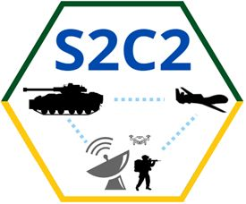

---
hide:
  - navigation
  - toc
---
# Interoperabilidade Semântica de Comando e Controle das Forças Armadas Brasileiras

{ align=left }

Pesquisas sobre Sistema de Sistemas (SoS) se intensificaram em diversas áreas de aplicação, sendo as mais comuns relacionadas a temas como defesa, militar, transportes e robótica. Para garantir que a comunicação entre os sistemas que
compõem um SoS ocorra de maneira eficiente, é importante que o SoS atenda a requisitos como confiabilidade e robustez em seu modo operação.

A literatura apresenta inúmeras definições de SoS. Em sua maioria, os autores concordam que o nascimento de um SoS se dá quando um conjunto de necessidades é atendido através de uma combinação de vários sistemas. Cada sistema pode operar de 
modo independente, mas cada um deve também interagir com outros sistemas em operação para atender às necessidades especificadas. Em um cenário militar, o Sistema de Sistemas de Comando e Controle (SoSC2) busca atender às demandas do Exército Brasileiro, e é fundamentado na necessidade de acompanhamento das operações em tempo real por parte das autoridades e dos comandantes militares em diversos níveis. Essa demanda exige equipamentos e técnicas para se ter um
C2 eficiente, dado que é um ambiente marcado pela volatilidade, incerteza e complexidade acerca das comunicações.

Entre os equipamentos usados em SoSC2 está o rádio. Mais recentemente, o Exército Brasileiro (EB) vem investindo pesadamente no chamado Rádio Cognitivo (RC) que permite a tomada de decisões na "ponta", materializando o conceito de *Power to the Edge*. O processo de tomada de decisão é de grande importância em dispositivos autônomos, como os rádios
cognitivos, e tem atraído o interesse de pesquisas da área da ciência da computação. Dentre os princípios inerentes às comunicações militares que representam requisitos operacionais relevantes, pode-se destacar a **rapidez**, indicando
a necessidade que as ligações sejam estabelecidas em tempo útil para surtir os efeitos desejados, a **simplicidade**, ressaltando a importância de que haja alternativas simples que atendem aos requisitos para os quais foram concebidas e a **flexibilidade**, que indica a necessidade de uma rápida adequação às mudanças das operações militares. Corroborando
com isso, redes de comunicações envolvendo questões de segurança nacional e operações militares dependem de quantidades cada vez maiores de dados, impactando diretamente na tomada de decisão e na necessidade de adequação rápida ao ambiente.

Para que tal ambiente funcione de modo satisfatório, é preciso estabelecer procedimentos adequados de gerência, de sorte que a tomada de decisão seja judiciosamente feita no contexto das operações militares.Permitir uma comunicação eficiente e segura vem sendo um desafio a ser superado diante da tecnologia oferecida. Para isso é necessário melhorar a interoperabilidade entre os sistemas, possibilitando que a organização tenha um bom nível de eficiência de seu Comando e Controle (C2). 

Nesse contexto, com a finalidade de **aprimoramento da interoperabilidade semântica de Comando e Controle das Forças Armadas Brasileiras**, é que surgiu o projeto “Sistema de Sistemas de Comando e Controle” - S2C2. Publicado no DOU no 16 de 25 de janeiro de 2021, Seção 3, página 7, o projeto S2C2 conta com o financiamento da FINEP/DCT/FAPEB, referência número 2904/20 sobre o contrato de número 01.20.0272.00.

